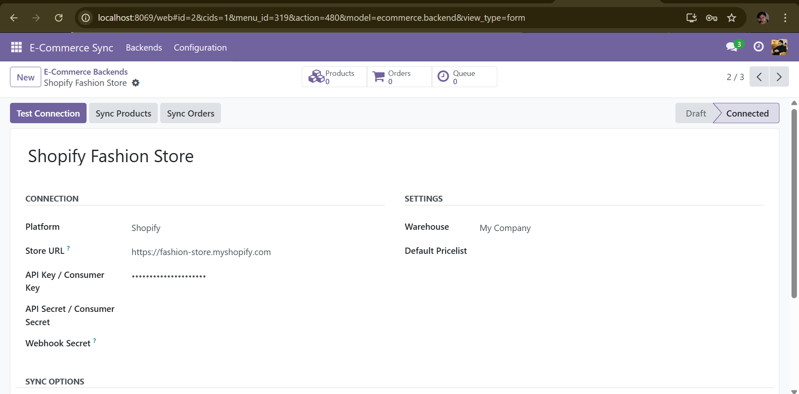
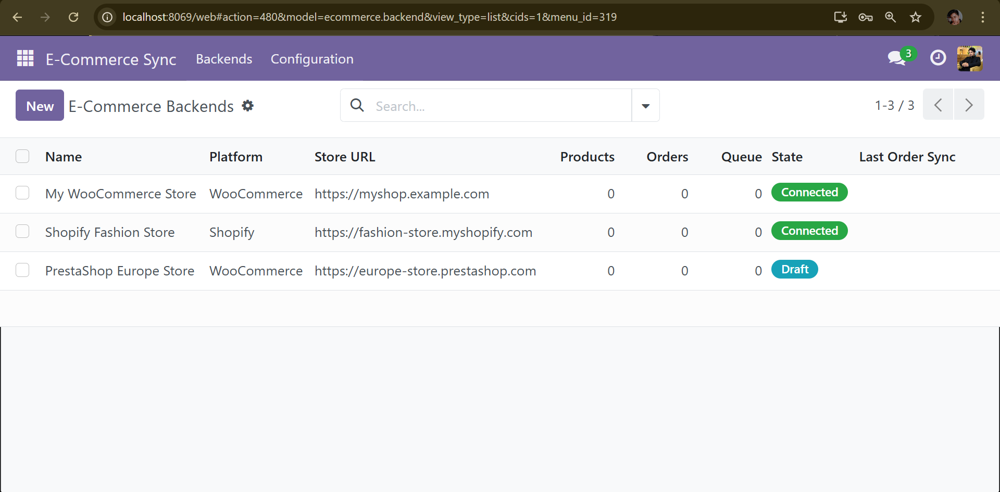
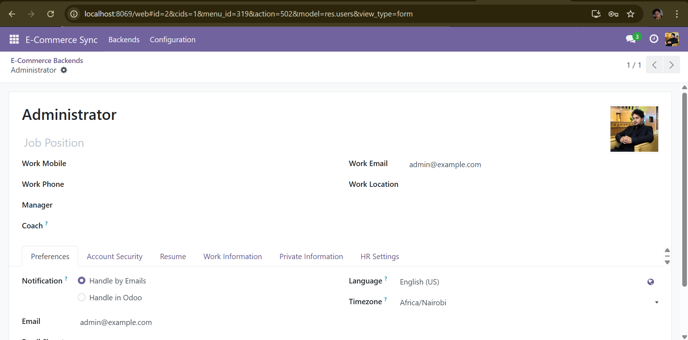

# odoo-ecommerce-sync

> Odoo 17 module — Bidirectional sync between Odoo and WooCommerce / Shopify via REST API and webhooks.

[](https://www.odoo.com)
[](https://python.org)
[](https://www.gnu.org/licenses/lgpl-3.0)

## Screenshots

| Backend Form | List View | Profile |
|---|---|---|
|  |  |  |

## Features

| Direction | What syncs |
|---|---|
| Platform → Odoo | Products, orders, customers |
| Odoo → Platform | Stock quantities, product updates |
| Real-time | Webhooks for instant order/product events |

- **Multi-backend**: manage multiple WooCommerce or Shopify stores from one Odoo instance
- **Webhook listener**: `/ecommerce/webhook/<backend_id>/<event>` with HMAC-SHA256 signature verification
- **Async queue**: `ecommerce.sync.queue` with exponential backoff retry (1m → 5m → 15m → 60m → 4h)
- **ID mapping table**: `ecommerce.sync.mapping` — clean bidirectional external/Odoo ID registry
- **Full audit log**: every import/export operation recorded in `ecommerce.sync.log`
- **Pagination**: handles WooCommerce page-based and Shopify cursor-based pagination
- **HTTP resilience**: `requests.Session` with `urllib3.Retry` (3 retries, backoff, 429/5xx handling)

## Architecture

```
Webhook POST ──→ WebhookController ──→ SyncQueue (priority=1)
Cron every 15min ─────────────────────→ SyncQueue._cron_process_queue()
                                              │
                              ┌───────────────┴───────────────┐
                              ▼                               ▼
                    ProductSyncer._import_product   OrderSyncer._import_order
                              │                               │
                    SyncMapping (external↔odoo)     SaleOrder.create()
                              │
                    product.template.write/create
```

## Technical highlights

| Area | Implementation |
|---|---|
| HTTP | `requests.Session` + `urllib3.Retry` with exponential backoff |
| Webhooks | HMAC-SHA256 signature verification, `csrf=False`, `auth='public'` |
| Queue | `ecommerce.sync.queue` with retry logic and permanent error escalation |
| Services | `AbstractModel` stateless services (`ecommerce.product.syncer`, `ecommerce.order.syncer`) |
| Mapping | Unique constraint on `(backend_id, model, external_id)` prevents duplicate imports |
| Logging | Structured `ecommerce.sync.log` — full audit trail |
| Inheritance | `product.template`, `sale.order`, `res.partner` extended non-invasively |

## Webhook setup

In your WooCommerce/Shopify admin, set the webhook URL to:
```
https://your-odoo.com/ecommerce/webhook/<backend_id>/<event_name>
```

Events handled:
- `order.created`, `order.updated` (WooCommerce) / `orders/create`, `orders/updated` (Shopify)
- `product.updated`, `product.created` (WooCommerce) / `products/update` (Shopify)

## Author

**Bayane Miguel Singcol** — Odoo Developer  
[GitHub](https://github.com/Bayane-max219) · baymi312@gmail.com
